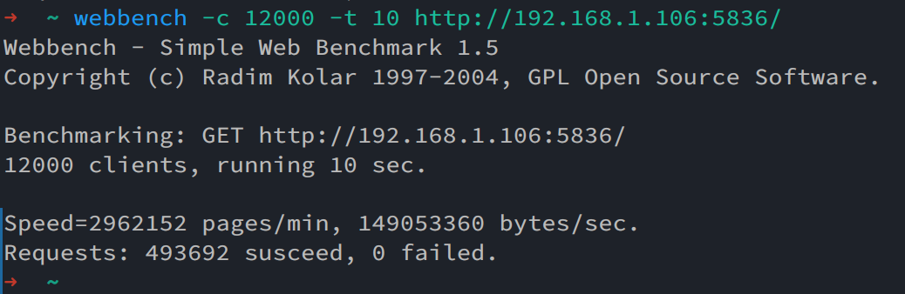

<div align=center></div>

**Lute is a event-driven network library in Linux. This project uses the epoll I/O event notification mechanism, and it supports GET/POST requests for HTTP protocol.**

## Dependency

- 编译器：g++ / clang
- 数据库：MySQL、Redis

## Deployment

1. CMake

    ```bash
    # CMake
    cmake -B build
    cmake --build build
    
    # Usage: /home/lux/githubWorkplace/Lute/build/bin/httpServer serverName staticSrcPrefix serverPort numThreads [IPofMySQLServer[default: 127.0.0.1] PortofMySQLServer[default: 3306] UsernameofMySQLServer[default: lutianen] PasswordofMySQLServer[default: lutianen] DatabaseofMySQLServer[default: user]]
    ./build/app/http/httpServer LuxPolaris /home/lux/Lux/app/HTML 5836 8 192.168.1.108 3306 lutianen lutianen LuxDatabase
    ```

2. Make

    ```bash
    # Make
    
    # optional
    make clean
    make release # make debug
    
    # Need to modify Makefile:
    # Usage: /home/lux/githubWorkplace/Lute/build/bin/httpServer serverName staticSrcPrefix serverPort numThreads [IPofMySQLServer[default: 127.0.0.1] PortofMySQLServer[default: 3306] UsernameofMySQLServer[default: lutianen] PasswordofMySQLServer[default: lutianen] DatabaseofMySQLServer[default: user]]
    make run
    ```

## Graphviz


## 特点

- 双缓冲高效异步日志
- HTTP 与网络库模块分离
- 支持 GET / POST 请求
- Reactor 高并发模型 ( One loop per thread )
- MySQL 连接池 + Redis 缓冲

## 压力测试

### Webbench

- **webbench with logger**

    **~4W QPS**  

    

- **webbench without logger**

    **~5W QPS**

    

## TODO List

- [ ]  Support Docker

## 附录

- [常用工具介绍](doc/tools.md)

- [GoogleTest 使用指南](doc/GoogleTest.md)

- [核心类介绍](doc/CoreClass.md)
